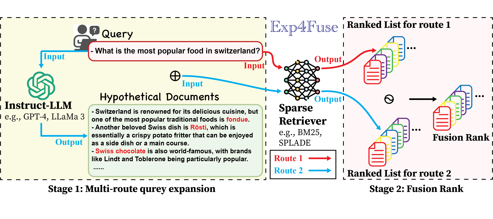

## Exp4Fuse: A Rank Fusion Framework for Enhanced Sparse Retrieval using Large Language Model-based Query Expansion

**📢 News: this work has been accepted at the ACL 2025 findings!** [paper](https://arxiv.org/abs/2506.04760)

We propose Exp4Fuse, a query expansion method using a LLM to enhance sparse retrievers. Exp4Fuse fuses two sets of retrieved document ranks from the same sparse retriever: one based on the original query and the other on an LLM-based zero-shot query expansion, to generate final retrieved document ranks. This method benefits from indirect LLM-based QE and combines results from different query formats, yielding high-quality retrieval outcomes.



Exp4Fuse can effectively perform zero-shot QE for various sparse retrievers, particularly learned sparse retrievers. Extensive experiments  demonstrate that Exp4Fuse outperforms existing LLM-based query expansion methods. Furthermore, when combined with advanced sparse retrievers, Exp4Fuse surpasses some SOTA baselines and remains competitive with others. 


## 1 Requirements

```bash
pip install transformers==4.30.2
pip install beir==1.0.1
pip install datasets==2.14.1
pip install tqdm
pip install scipy
pip install evaluate==0.2.2
pip install spacy==3.7.2
pip install accelerate
pip install elasticsearch==7.17.9
pip install pyserini
pip install fassi-cpu
pip install numpy
pip install nltk
```
or
```bash
bash install.sh
```

## 2 Resourse
### 2.1 Prebuilt faiss index

Install [pyserini](https://github.com/castorini/pyserini#-installation) and download the [prebuilt faiss index](https://github.com/castorini/pyserini/blob/master/docs/prebuilt-indexes.md) for 'msmarco-v1-passage.ance','msmarco-v1-passage.aggretriever-cocondenser','msmarco-v1-passage.aggretriever-distilbert','msmarco-v1-passage.tct_colbert-v2'. We use pyserini to conduct retrieval and evaluation.

### 2.2 Example Hypothesis Documents
We provide example hypothesis documents generated using 'gpt-4o-mini' in the following directory:
*TREC DL19 data/dl19_hypothesis*


## 3 Run

Run 'Exp4Fuse-demo-dl19.ipynb', it will run the experiments for Exp4Fuse on the TREC DL19 dataset in six embeddings.

### 3.1 Reproduce with OpenRouter (openai/gpt-oss-120b:free)

To reproduce the pipeline using the paper’s **test cases**, **prompt** (TREC DL19: “Please write a passage to answer the question.”), and **OpenRouter** with `openai/gpt-oss-120b:free`:

1. **API key**  
   Create a `.env` file in `Exp4Fuse/` (or in the parent `SSD/` directory) with:
   ```bash
   OPENROUTER_API_KEY=your-openrouter-key
   ```

2. **Generate hypothesis documents** (paper prompt, 128 tokens, temp 0.6, top_p 0.9):
   ```bash
   cd Exp4Fuse
   pip install openai   # if not already
   python generate_dl19_hypothesis.py
   ```
   This reads `TREC DL19 data/dl19_topics`, calls OpenRouter for each query, and writes `TREC DL19 data/dl19_hypothesis` and `dl19_hy`.

3. **Run retrieval + fusion + evaluation** (BM25, RRF k=60, MAP / nDCG@10 / Recall@1k):
   ```bash
   python run_exp4fuse_dl19.py
   ```
   This uses the paper’s pipeline: original run, hypothesis-augmented run, fusion, then `trec_eval` on `dl19-passage`. Results are printed for BM25 and BM25+Exp4Fuse.

If you skip step 2, `run_exp4fuse_dl19.py` will use the existing `TREC DL19 data/dl19_hypothesis` (e.g. the provided gpt-4o-mini hypotheses) so you can still run the pipeline.

**Note:** Retrieval and evaluation require `pyserini` (and **JDK 21**—Pyserini’s JARs are built with Java 21; install with `sudo apt install openjdk-21-jdk` and select it via `update-alternatives --config java` if you see UnsupportedClassVersionError or “class file version 65.0”). Install with `pip install pyserini` and ensure Java is available, or use the project’s `install.sh` / requirements from section 1. 

## Citation

```
@misc{liu2025exp4fuserankfusionframework,
      title={Exp4Fuse: A Rank Fusion Framework for Enhanced Sparse Retrieval using Large Language Model-based Query Expansion}, 
      author={Lingyuan Liu and Mengxiang Zhang},
      year={2025},
      eprint={2506.04760},
      archivePrefix={arXiv},
      primaryClass={cs.IR},
      url={https://arxiv.org/abs/2506.04760}, 
}
```
